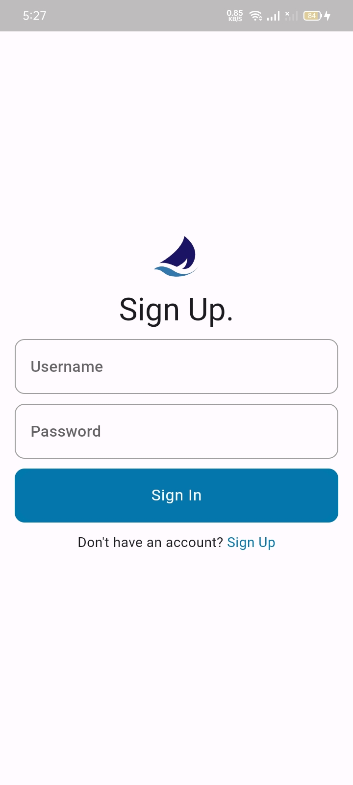
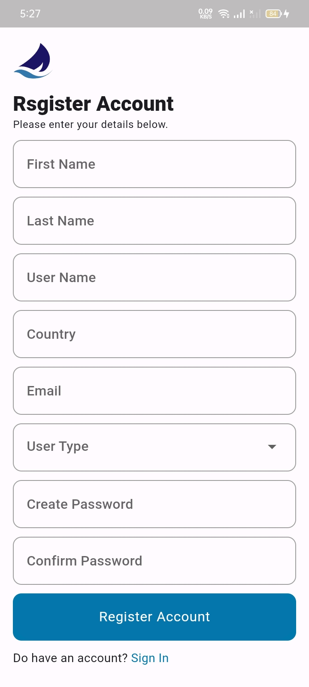
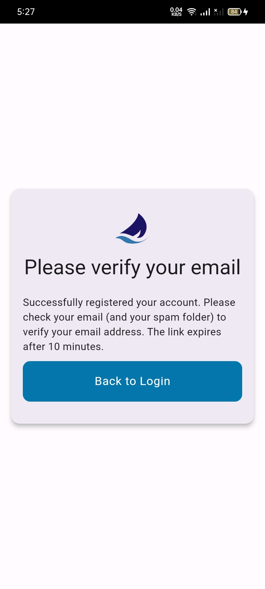
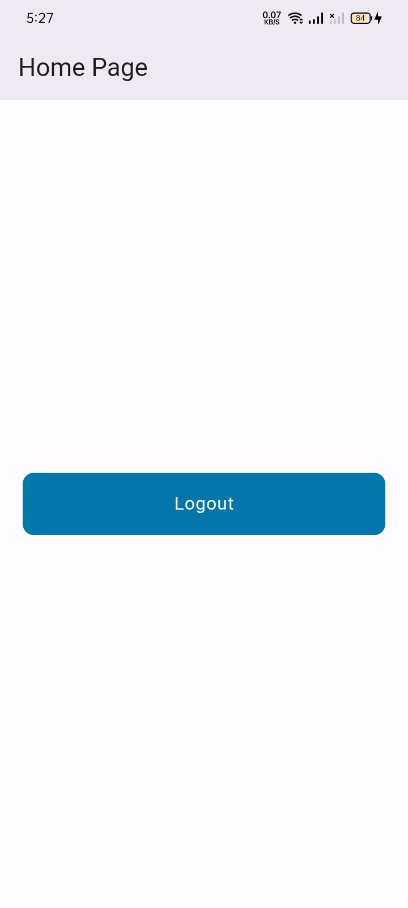

# aak_tele_science

## Screenshots






# Setup and Installation Guide

## Overview

This guide provides step-by-step instructions to run a Flutter project from GitHub on your local system and install the app on your device.

## Prerequisites

1. **Flutter**: Ensure that Flutter is installed on your system. Follow the [official Flutter installation guide](https://flutter.dev/docs/get-started/install) if you haven't installed it yet.

2. **Visual Studio Code**: Download and install [Visual Studio Code](https://code.visualstudio.com/).

3. **Flutter and Dart Extensions**: Install the Flutter and Dart extensions in Visual Studio Code.
   - Open Visual Studio Code.
   - Go to the Extensions tab (Ctrl+Shift+X).
   - Search for "Flutter" and "Dart" extensions and install them.

## Steps to Run the Project

1. **Clone the GitHub Repository**

   - Open Visual Studio Code.
   - Go to the Source Control tab (Ctrl+Shift+G).
   - Click on "Clone Repository".
   - Paste the URL of the GitHub repository and choose a directory where you want to clone the repository.

2. **Open the Project**

   - Once the cloning process is complete, open the cloned project folder in Visual Studio Code.

3. **Install Dependencies**

   - Open the terminal in Visual Studio Code (Ctrl+`).
   - Run the following commands:
     ```bash
     flutter clean
     flutter pub get
     flutter upgrade
     flutter run
     ```

4. **Connect Your Device**
   - Connect your Android or iOS device to your system using a USB cable.
5. **Enable Developer Mode on Your Device**
   - For Android:
     - Go to `Settings`.
     - Tap on `About Phone`.
     - Tap `Build Number` seven times until developer mode is enabled.
6. **Enable USB Debugging**

   - For Android:
     - Go to `Settings`.
     - Tap on `Developer options`.
     - Toggle on `USB Debugging`.

7. **Run the App**
   - In Visual Studio Code, select your connected device from the device selector (bottom right corner).
   - Click the “Run” button (or press F5) to start the app on your device.

## Troubleshooting

- Ensure that your Flutter installation is properly set up by running `flutter doctor` in the terminal. This will provide information about any missing dependencies or setup issues.

- If you encounter issues with dependencies, try running `flutter pub get` again.

- For device connection issues, ensure USB Debugging is enabled and that the device is properly recognized by your system.

## Additional Resources

- [Flutter Documentation](https://flutter.dev/docs)
- [Visual Studio Code Documentation](https://code.visualstudio.com/docs)
